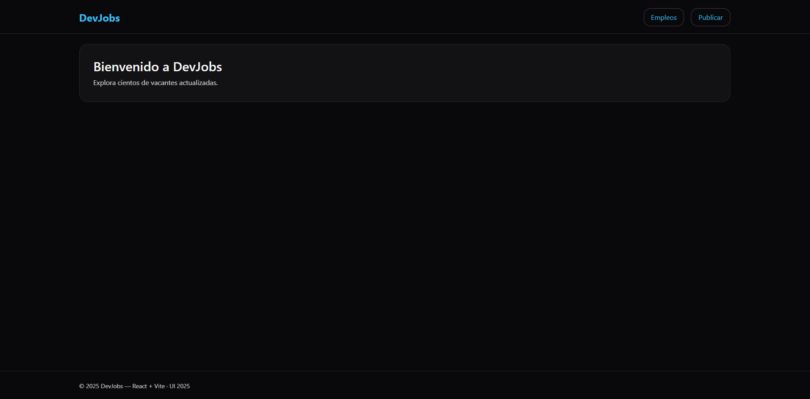

# 🚀 DevJobs Frontend (React + Vite + TypeScript)

Plataforma moderna (2025) para **gestionar y descubrir ofertas de empleo tecnológicas**, desarrollada como parte del proyecto formativo del SENA.

---

## 🧠 Descripción General

DevJobs es una aplicación **SPA (Single Page Application)** construida con React, Vite y TypeScript.  
Incluye un **API simulado con JSON Server**, integración de **SEO técnico y SEM**, y una interfaz moderna basada en TailwindCSS.

---

## 🧩 Estructura del Proyecto

```
devjobs-frontend/
│
├── public/               # Archivos estáticos (favicon, manifest, robots, sitemap)
├── server/               # Mock API (JSON Server)
├── src/
│   ├── app/              # Shell principal y router
│   ├── components/       # Componentes reutilizables (UI, SEO, Analytics)
│   ├── lib/              # API Axios, schemas Zod, helpers SEO
│   ├── pages/            # Vistas (Home, Jobs, JobDetail, JobForm, NotFound)
│   ├── assets/           # Imágenes, estilos
│   └── main.tsx          # Punto de entrada
│
├── scripts/              # Generador de sitemap automático
├── package.json          # Dependencias y scripts
└── README.md             # Este archivo
```

---

## ⚙️ Instalación y Ejecución Local

### 1️⃣ Clonar el repositorio

```bash
git clone https://github.com/sergiosilva-dev/devjobs-frontend.git
cd devjobs-frontend
```

### 2️⃣ Instalar dependencias

```bash
npm install
```

### 3️⃣ Variables de entorno

Crea el archivo `.env` a partir del ejemplo:

```bash
cp .env.example .env
```

Valores por defecto:

```
VITE_API_URL=http://localhost:5174/api
VITE_SITE_URL=http://localhost:5173
VITE_GA_ID=
```

### 4️⃣ Ejecutar entorno de desarrollo

```bash
npm run dev
```

Esto levantará dos servicios:

- **Frontend:** http://localhost:5173
- **API Mock:** http://localhost:3000/jobs

---

## 🧮 Scripts Disponibles

| Comando           | Descripción                                        |
| ----------------- | -------------------------------------------------- |
| `npm run dev`     | Ejecuta Vite + JSON Server concurrentemente        |
| `npm run build`   | Compila la app y genera el sitemap automáticamente |
| `npm run preview` | Previsualiza la build en local                     |
| `npm run lint`    | Ejecuta ESLint (Flat Config)                       |
| `npm run format`  | Aplica formato con Prettier                        |

---

## 🌐 SEO y SEM

- **Helmet + React Helmet Async:** Títulos y metadatos dinámicos.
- **JSON-LD estructurado:** Schema.org `JobPosting` por oferta.
- **robots.txt / sitemap.xml:** auto-generados en build.
- **Manifest y PWA ready.**
- **Open Graph / Twitter Cards:** con `og-image.png` (1200x630).
- **Google Analytics 4 (opcional):** via `VITE_GA_ID`.

---

## 🧰 Tecnologías Utilizadas

| Tipo       | Herramienta                                                    |
| ---------- | -------------------------------------------------------------- |
| Framework  | [React 18](https://react.dev/) + [Vite 5](https://vitejs.dev/) |
| Lenguaje   | [TypeScript 5](https://www.typescriptlang.org/)                |
| Estilos    | [TailwindCSS 3](https://tailwindcss.com/)                      |
| API mock   | [JSON Server 1.x](https://github.com/typicode/json-server)     |
| Linter     | ESLint (Flat Config)                                           |
| Formato    | Prettier                                                       |
| Validación | [Zod](https://zod.dev/)                                        |
| SEO        | React Helmet Async + JSON-LD                                   |
| SCM        | Git + GitHub                                                   |
| CI/CD      | GitHub Actions (opcional)                                      |

---

## 🧱 Componentes Clave

| Componente       | Función                                               |
| ---------------- | ----------------------------------------------------- |
| `Seo.tsx`        | SEO dinámico (canonical, OG/Twitter, JSON-LD, robots) |
| `Analytics.tsx`  | Inyección GA4 opcional                                |
| `JobCard.tsx`    | Tarjeta resumen de oferta                             |
| `Pagination.tsx` | Control de paginación                                 |
| `SearchBar.tsx`  | Búsqueda controlada                                   |
| `JobForm.tsx`    | Formulario de publicación/edición                     |
| `JobDetail.tsx`  | Detalle + datos estructurados JobPosting              |

---

## 🧠 Accesibilidad (a11y)

- Elementos semánticos (`<nav>`, `<header>`, `<main>`, `<footer>`)
- `aria-label` en formularios y navegación
- Contraste verificado WCAG AA
- Navegación por teclado garantizada

---

## 🔍 SEO Técnico

| Elemento                       | Estado |
| ------------------------------ | ------ |
| Título y descripción dinámicos | ✅     |
| Canonical absoluto             | ✅     |
| Open Graph / Twitter           | ✅     |
| JSON-LD (JobPosting)           | ✅     |
| robots.txt + sitemap.xml       | ✅     |
| Manifest / PWA                 | ✅     |
| Google Analytics (opcional)    | ✅     |

---

## 🧾 Estándares de Código

- [x] **Convencional Commits**
- [x] **Pre-commit con Husky y lint-staged**
- [x] **Formateo Prettier + ESLint integrado**
- [x] **Tipado estricto (TypeScript strict mode)**
- [x] **Componentes funcionales con Hooks**

---

## 📦 Build y Despliegue

```bash
npm run build
npm run preview
```

Se generará la carpeta `/dist` lista para subir a **Vercel**, **Netlify**, **GitHub Pages** o un servidor estático.

---

## 🧩 Licencia

Este proyecto se distribuye bajo la licencia [**MIT**](LICENSE).

---

## Previsualización



---

## 👨‍💻 Autor

**Sergio Silva (Up Develop)**  
📧 ssilva@updevelop.com.co
🌐 [https://updevelop.com.co](https://updevelop.com.co)

---

### 🏁 Proyecto Formativo SENA

> Evidencia: GA7-220501096-AA4-EV03 — _Componente frontend del proyecto formativo y proyectos de clase (listas de chequeo)_

Incluye:

- Codificación completa del módulo frontend.
- Comentarios de código y estándares aplicados.
- Implementación de componentes React y SEO técnico.
- API simulada (JSON Server).
- Control de versiones con Git/GitHub.
